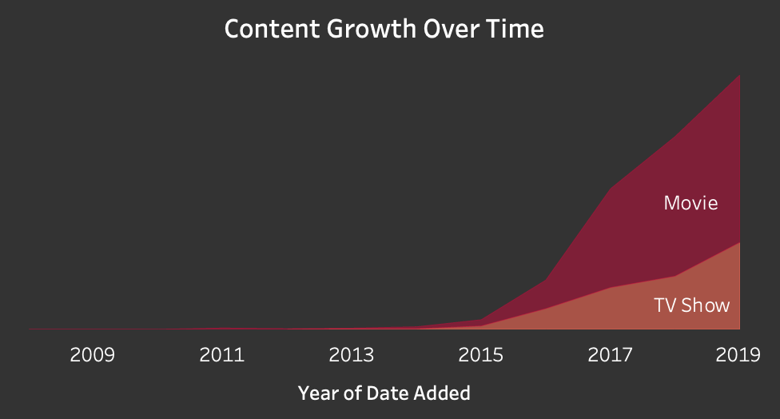
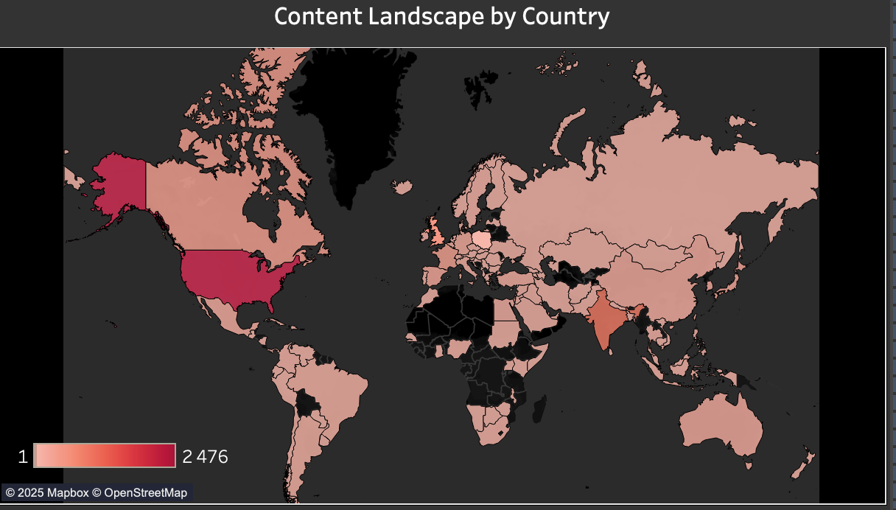
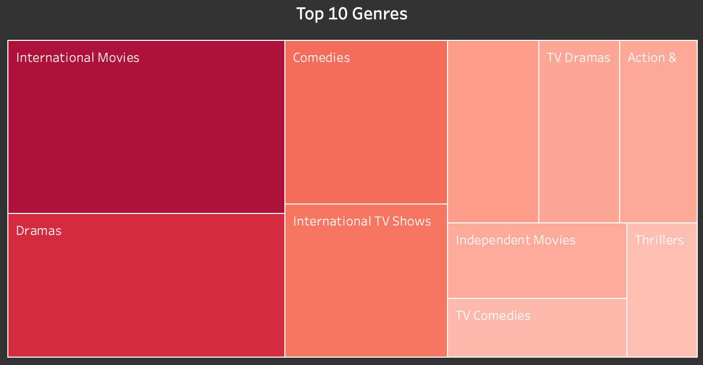
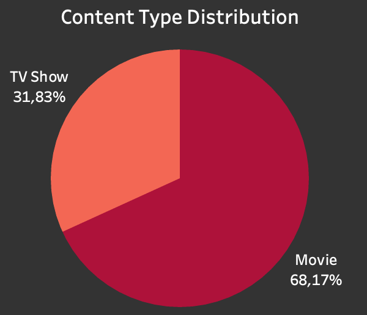

# Netflix Content Dashboard

## Project Background
**Netflix** operates in a highly competitive global streaming market where content strategy plays a critical role in attracting and retaining subscribers. This project aims to analyze Netflix's content distribution, growth trends, and genre preferences to understand how the platform has evolved over time and what strategic decisions may be driving its expansion.

**Insights and recommendations are provided on the following key areas**:
•	Content Growth: Analyzing the expansion of Netflix’s library.
•	Global Strategy: Identifying countries contributing the most content.
•	Genre Preferences: Understanding which genres dominate Netflix’s offerings.
•	Movies vs. TV Shows: Exploring the balance between movies and TV shows over time.
The dataset was cleaned, analyzed, and visualized using Python in Jupyter Notebook. The final interactive Tableau dashboard reporting Netflix's content and user trends can be found here: [Netflix Content Dashboard - Tableau Public](https://public.tableau.com/app/profile/adina.nabi/viz/Netflix_Dashboard_17388727636040/NetflixOverview).

## Data Structure & Initial Checks
The dataset used for this dashboard is sourced from the [Netflix Titles Dataset on GitHub](https://github.com/DataScienceRoadMapDSRM/Tableau-Dashboards-info/blob/6eabd6614c1b3e5f793006cbcc6fd9dd03505c55/netflix_titles.csv). It includes detailed information about movies and TV shows available on Netflix, such as title, genre, rating, country, cast, director, and more.

The data cleaning and preprocessing process began with an initial assessment to identify missing values and inconsistencies. Missing data in key columns such as director, cast, and country were replaced with "Unknown," while genre information was labeled as "Unknown" and missing ratings were assigned "Not Rated" to maintain data consistency.

To ensure proper data structure, ratings were converted to categorical format, the release year was validated as numeric, and the duration column was split into a numeric value and unit (minutes or seasons). Multi-value fields such as country and genre were separated and expanded to allow for better aggregation, while director and cast details were preserved as list-type columns.

Finally, a unique original_id was introduced to maintain data integrity and ensure accurate row tracking. The cleaned dataset was then exported as a CSV file, ready for visualization in Tableau.

## Executive Summary
The analysis of Netflix’s content strategy reveals key trends:

•	**Steady Growth**: Netflix’s library has expanded significantly, especially since 2015. In 2019, movies grew by 19.9%, while TV shows surged by 63.1%.

•	**Global Expansion**: The United States, India, and the UK lead in content production, followed by Canada, France, Japan, Spain, South Korea, Germany, Mexico, and Australia.

•	**Shifting Content Strategy**: Movies still dominate (68.17%), but Netflix is rapidly expanding TV show offerings, likely to enhance audience retention.

•	**Genre Trends**: International Movies, Drama, and Comedy are the most common genres, with Documentaries and Thrillers gaining popularity.

## Insights
***How has Netflix’s content library grown over time?***

Netflix’s content library has grown significantly since 2015, with an increasing number of titles added each year. Movies remain the dominant content type, but TV shows have seen faster growth rates, particularly in recent years.
In 2019, movies increased by 19.9% (1,546 titles), while TV shows grew by 63.1% (803 titles). Despite this, movies still represent the majority of Netflix’s catalog, with a total of 4,117 movie titles compared to 1,922 TV shows.

***Which countries contribute the most content, and what does this suggest about Netflix’s global strategy?***

Geographically, the U.S., India, and the U.K. are the top content producers, reinforcing Netflix’s focus on large, English-speaking markets. However, regional diversification is increasing, with Canada, France, Japan, Spain, South Korea, and Germany emerging as key contributors. This signals a global expansion strategy aimed at penetrating local markets and competing with regional streaming platforms. 

***What are the most popular genres, and how do they align with consumer preferences?***

The most dominant genres on Netflix are International Movies, Drama, and Comedy, highlighting the platform’s diverse content catalog. Drama remains a key category, appealing to a wide range of viewers, while Comedy continues to be a staple, providing accessible entertainment for global audiences. Interestingly, International Movies and International TV Shows appear as distinct genre categories, suggesting that Netflix has a unique classification system for globally distributed content. 
The genre distribution underscores Netflix’s approach to balancing mainstream entertainment with niche content, ensuring that both broad audiences and specific interest groups are engaged. This strategy enables Netflix to retain a loyal subscriber base while attracting new viewers through a constantly evolving content mix.

***How does the distribution of Movies vs. TV Shows impact the platform's offerings?***

Netflix’s catalog remains movie-heavy (68.17%), but TV shows have grown significantly, increasing by 63.1% in 2019 alone. This suggests a strategic shift toward episodic content, likely driven by its ability to increase watch time, subscriber retention, and franchise potential. 

## Recommendations
**1. Expand International Content & Strengthen Regional Investments**

With India, the U.K., and the U.S. leading in content production, Netflix should deepen investments in high-growth regions like South Korea, Japan, and Latin America. Expanding localized content will boost subscriber growth and engagement in diverse markets.

***Strategic Actions:***
•	Fund more regional productions in key non-English markets.
  
•	Expand Spanish, Korean, and Japanese content, leveraging their global appeal.
  
•	Strengthen dubbing and subtitling to improve accessibility.
  
•	Use co-productions and licensing to expand content variety efficiently.
  

**2. Diversify Genre Offerings & Tap into Emerging Preferences**

While Drama and Comedy dominate, rising interest in Documentaries, Thrillers, and International content presents growth opportunities. Expanding niche genres can attract new audiences and enhance engagement.

***Strategic Actions:***
•	Increase investments in Documentaries, Thrillers, and Sci-Fi/Fantasy.

•	Expand niche genres with strong fan bases, such as Horror and Political Drama.

•	Use data-driven recommendations to personalize genre discovery.

•	Enhance marketing for underutilized and regional genres.

**3. Focus on TV Show Production & Maximize Viewer Retention**

TV shows have grown 63.1% in 2019, outpacing movies, showing that episodic content drives engagement and long-term retention.

***Strategic Actions:***

•	Prioritize multi-season franchises to sustain subscriber interest.

•	Expand regional TV content, especially K-dramas and Spanish-language series.

•	Develop cost-effective reality and competition shows to boost engagement.

•	Use AI-driven recommendations to increase viewership continuity.

**4. Maintain a Balanced Movie Library & Maximize Blockbuster Potential**

Despite TV’s growth, movies still make up 68.17% of Netflix’s catalog and play a crucial role in attracting new subscribers. A balance of original productions and exclusive acquisitions is essential.

***Strategic Actions:***

•	Continue producing high-budget originals in high-engagement genres.

•	Secure exclusive streaming rights for major theatrical releases.

•	Leverage AI-powered curation to drive personalized movie recommendations.

•	Explore limited-time exclusives to create demand for premium content.

## Tools and Technologies Used:
•	Python: For data cleaning and transformation using Pandas.

•	Jupyter Notebook: To perform the analysis and document the process.

•	Tableau: For building the interactive dashboard.

---

