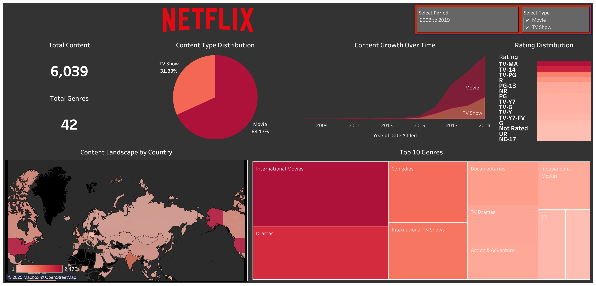

# Netflix Content Dashboard

## Overview

The **Netflix Content Dashboard** provides insights into Netflix's content library, allowing users to explore distribution patterns, content growth trends, and detailed information about movies and TV shows. This interactive dashboard is designed to help stakeholders analyze key metrics and trends, such as the most popular genres, top countries with content, and content growth over time.

## Dataset Source

The dataset used for this dashboard is sourced from the [Netflix Titles Dataset on GitHub](https://github.com/DataScienceRoadMapDSRM/Tableau-Dashboards-info/blob/6eabd6614c1b3e5f793006cbcc6fd9dd03505c55/netflix_titles.csv). It includes detailed information about movies and TV shows available on Netflix, such as title, genre, rating, country, cast, director, and more.

## Data Cleaning Process

The dataset underwent a thorough cleaning process to ensure data quality and consistency. Key cleaning steps include:

- Handling missing values (e.g., 'Unknown' for missing director, cast, country).
- Splitting multi-valued columns (e.g., 'listed_in' and 'country') into individual rows for accurate analysis.
- Ensuring the proper data types for fields like 'rating' and 'release year'.
- Creating new calculated fields to handle specific transformations, such as separating duration into numeric and unit components.

## Key Insights

- **Content Distribution**: Visualize how Netflix's content is distributed by country and genre.
- **Content Growth**: Track how Netflix's catalog has expanded over the years, with insights on the number of movies and TV shows added each year.
- **Detailed Content Information**: View detailed data on individual movies and TV shows, including:
  - Title, Description, Genre
  - Director, Cast, Release Year, Rating, Duration
- **Genre & Director Insights**: Discover top movies/TV shows by genre and other works by the same director.

## Features

- **KPI Cards**: Display key metrics like total content count, top country, and most frequent rating.
- **Interactive Map**: View content distribution by country.
- **Top Genres**: Analyze the most frequent genres with a bar chart.
- **Content Growth Over Time**: See Netflix’s content expansion over the years.
- **Movie & TV Show Details**: Access detailed information for any selected title.

## Interactivity

- **Filters**: Filter by content type (Movie or TV Show), country, genre, rating, and release year.
- **Title Selection**: Choose a specific title to view its details.
- **Hover/Click Actions**: Hover over the map or click on genres to explore related content.

## Access the Dashboard

Explore the live interactive dashboard on Tableau Public:

[Netflix Content Dashboard - Tableau Public](https://public.tableau.com/app/profile/adina.nabi/viz/Netflix_Dashboard_17388727636040/NetflixOverview)

---

